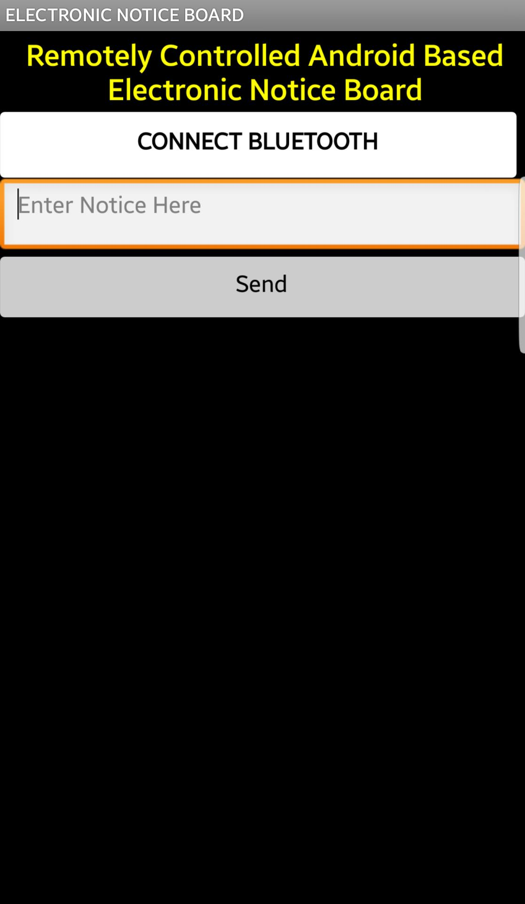
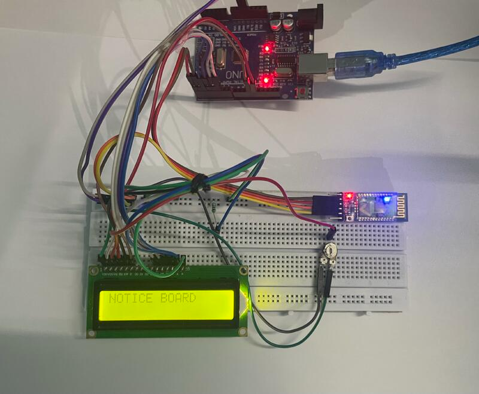
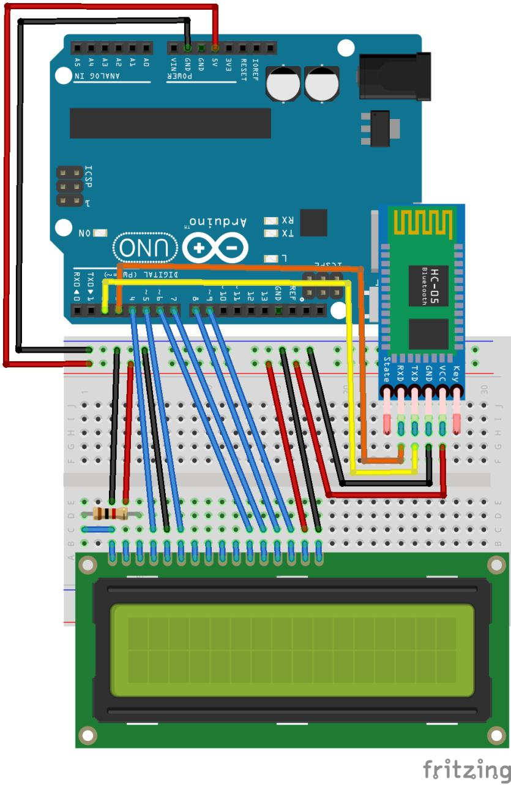

# Remotely-Controlled-Electronic-Noticeboard-Using-NodeMCU

Research Paper: https://ieeexplore.ieee.org/document/10306793

In today's rapidly advancing technological landscape, traditional notice boards have become outdated and inefficient for disseminating information effectively. These static boards require manual updates, resulting in delays and inconveniences for both the administrators and users. To address these limitations, this research paper proposes the design and implementation of a remotely controlled notice board using the Arduino UNO microcontroller and an 2x16 LCD display. This innovative solution leverages the power of IoT (Internet of Things) and wireless communication to provide real-time updates and enhance communication efficiency in various settings.

# Application Interface

Steps to use the Application:
1:First click on "CONNECT BLUETOOTH".
2:It will take to the available devices with bluetooth on.
3.Select "HC-05".
4.After selection it will take you back to main activity where if the connection is successful the colour of the button "CONNECT BLUETOOTH" with turn blue.
5.Type whatever you want to display on the Notice Board in the edit text bar.
6.Click on "Send".

# Physical Project
Components Used:
-Arduino UNO Microcontroller
-HC-05 Bluetooth Module
-2x16 LCD Display
-10ohm Preset
-Jumper Wires
-Bread Board

# Circuit Diagram